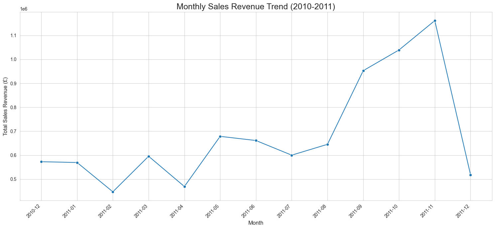

# E-commerce Sales Analysis

### An Exploratory Data Analysis of an Online Retail Dataset


## Project Overview

This project provides an in-depth exploratory data analysis (EDA) of a transactional dataset from a UK-based online retail store. The goal is to uncover patterns and trends in sales data, identify peak sales periods, and segment customers to provide actionable business insights.

The analysis involves significant data cleaning, feature engineering to extract time-based insights, and visualization of key metrics using Python's data science stack (Pandas, Matplotlib, Seaborn).

## Key Objectives & Questions

The analysis is structured to answer the following business questions:
1.  What are the overall sales trends over time (monthly)?
2.  Which days of the week and hours of the day are the most profitable?
3.  Who are the top customers and which countries contribute the most to revenue?
4.  What are the best-selling products?

## Dataset

The dataset used is the "Online Retail" dataset from the UCI Machine Learning Repository. It contains transactional data for all purchases made between 01/12/2010 and 09/12/2011.

**Data Cleaning Performed:**
*   Handled over 135,000 rows with missing `CustomerID`.
*   Removed transactions with negative quantities (returns/cancellations).
*   Filtered out data points with a unit price of zero.
*   Corrected data types for `CustomerID`.

## Technical Stack

*   **Language:** Python 3.13
*   **Libraries:**
    *   Pandas & NumPy for data cleaning and manipulation.
    *   Matplotlib & Seaborn for data visualization.
    *   JupyterLab for interactive analysis.
*   **Environment Management:** `uv`

## How to Run This Project

To reproduce this analysis, please follow these steps:

1.  **Clone the repository:**
    ```bash
    git clone https://github.com/YOUR_USERNAME/ecommerce-sales-analysis.git
    cd ecommerce-sales-analysis
    ```

2.  **Create and activate a virtual environment:**
    ```bash
    uv venv
    source .venv/bin/activate
    ```

3.  **Install the required packages from `requirements.txt`:**
    ```bash
    uv pip install -r requirements.txt
    ```

4.  **Launch JupyterLab:**
    ```bash
    jupyter lab
    ```
    Then, open the `ecommerce_analysis.ipynb` notebook and run the cells.

## Visualizations Showcase

*(This section will be filled with key charts and plots as they are generated during the analysis.)*

**Example:**
<!--  -->
<!-- *A line chart showing the total sales revenue per month.* -->

## Possible Next Steps

*   **Customer Segmentation:** Perform RFM (Recency, Frequency, Monetary) analysis to segment customers into valuable groups.
*   **Predictive Modeling:** Build a model to forecast future sales or predict customer churn.
*   **Market Basket Analysis:** Identify which products are frequently purchased together.